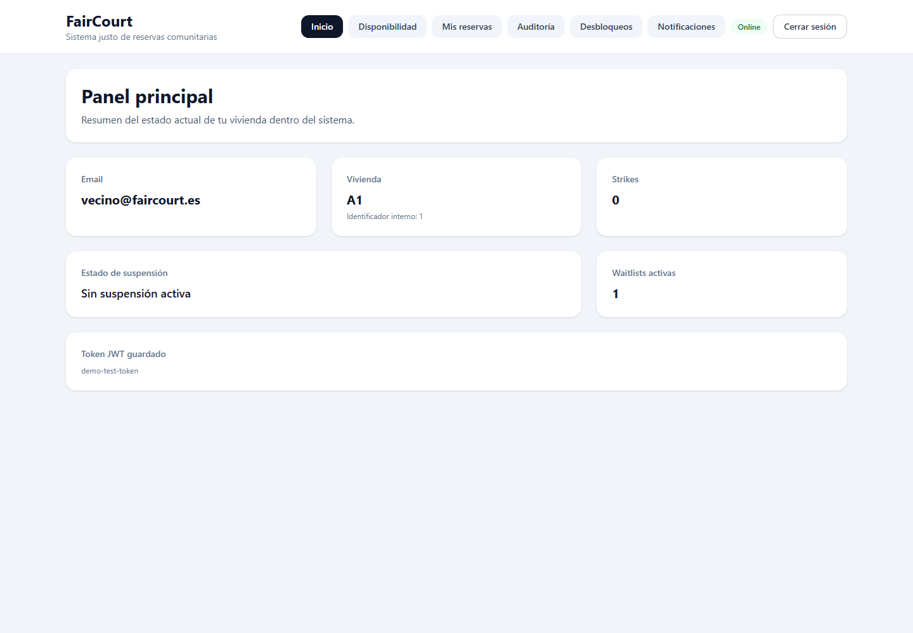
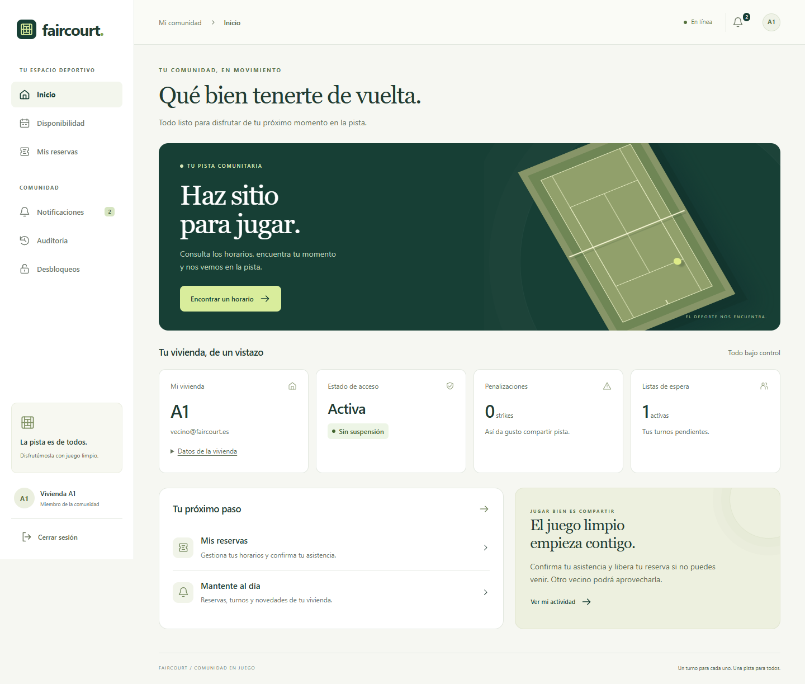

# Renovación de FairCourt — correspondencia y verificación

La matriz se registró antes de sustituir la interfaz. Esta versión completa su
verificación después de la renovación e incorpora el ámbito multi-comunidad en
el acceso. Los contratos OTP incluyen ahora `community_slug`; reservas, datos
offline y recursos del usuario quedan fijados a esa comunidad.

## Matriz funcional completada

Todas las capacidades inventariadas tienen una ubicación en la nueva interfaz y una prueba superada. Las referencias de la última columna corresponden a los prefijos de los escenarios en [frontend.spec.ts](../faircourt-frontend/tests/frontend.spec.ts), [accessibility.spec.ts](../faircourt-frontend/tests/accessibility.spec.ts) y [pwa.spec.ts](../faircourt-frontend/tests/pwa.spec.ts).

| Capacidad original o requisito | Nueva ubicación | Pruebas superadas |
| --- | --- | --- |
| Solicitar OTP en un portal comunitario con vivienda y correo; verificar; volver; sesión persistente; salir | Acceso y navegación | auth; connectivity |
| Vivienda, correo, identificador, penalizaciones, suspensión y listas activas | Inicio y detalles de vivienda | home |
| Consultar una fecha y actualizar manualmente | Agenda diaria; fecha conservada al actualizar o cambiar de sección | agenda; booking; offline |
| Libre/ocupado, reserva propia, pertenencia y tamaño de lista de espera | Franja de agenda | agenda |
| Reservar y entrar en lista; motivos de bloqueo y restricciones | Acciones de franja según permisos del servidor | booking; agenda |
| Reservas activas y pasadas; estado calculado y persistido, incluidos estados desconocidos | Próximas reservas e historial; detalles desplegables | reservations |
| Cancelación con confirmación | Diálogo integrado con control y restitución del foco | cancellation; visual |
| Generar, abrir y copiar enlace de asistencia; caducidad | Diálogo de asistencia | checkin |
| Avisos completos, tipo, fecha, leídos/pendientes, marcado individual y contador | Vista rápida en la campana; página completa desde la navegación o el acceso “Ver todas” | notifications |
| Eventos, códigos, identificadores y todos los metadatos | Auditoría y detalles, incluidos eventos desconocidos y metadatos sin formato válido | audit |
| Crear propuesta con motivo, consultar vivienda, estados, fechas y resolución | Desbloqueos | proposals |
| Votar a favor/en contra; impedir voto propio o en propuesta cerrada | Propuestas | voting |
| Enviar nombre, e-mail, teléfono y motivo de una consulta | Contacto | contact |
| Cargas, vacíos, errores del servidor y reintento | Estados compartidos sin desmontar la página durante las actualizaciones | errors; agenda; booking; cancellation; proposals |
| Lectura cacheada, bloqueo de escrituras y reconexión | Todas las secciones; fecha seleccionada conservada | offline; connectivity; pwa |
| PWA, recursos locales y apertura sin conexión | Manifiesto, iconos e interfaz de producción | pwa |
| Navegación de escritorio y móvil con acceso a todas las secciones | Barra lateral y navegación inferior con menú Más | visual; accessibility |
| Tema claro u oscuro, preferencia inicial del sistema y elección persistente | Selector de apariencia en acceso y barra superior | appearance; accessibility |
| Operación por teclado y contenido adaptable | Etiquetas, foco visible, enlace de salto, diálogos y movimiento reducido | accessibility; visual; responsive |

## Resultado de las comprobaciones

- **33 pruebas de navegador superadas** sobre la compilación de producción, con Microsoft Edge y respuestas de API controladas.
- **Compilación y análisis estático correctos**, sin desactivar globalmente las reglas. Los archivos generados y los informes temporales quedan excluidos del análisis y de Git.
- Nueve vistas capturadas a **375, 768 y 1440 píxeles**: acceso, OTP, inicio, disponibilidad, reservas, notificaciones, auditoría, desbloqueos y diálogo. Se comprueba ausencia de desbordamiento horizontal, contenido largo y navegación de teclado.
- Auditoría automatizada de contraste y semántica en los temas claro y oscuro, en móvil y escritorio, más comprobaciones de foco y movimiento reducido.
- Comprobaciones de errores del servidor, pulsaciones repetidas, respuestas tardías al cambiar rápidamente de día, estados desconocidos y recuperación de la carga inicial.
- Consulta sin conexión con caché, consulta sin datos guardados, bloqueo de escrituras, API inaccesible aunque el navegador indique conexión y recuperación al reconectar.
- PWA de producción: manifiesto, dimensiones reales de iconos, requisitos de instalación del navegador y recarga sin red mediante el service worker, con caché HTTP desactivada.

Las pruebas usan datos ficticios y no crean reservas ni votos en la base de datos real. La validación de instalación comprueba los requisitos del navegador; no crea un acceso directo en el sistema operativo. La validación visual combina capturas revisadas con comprobaciones automatizadas; no representa una certificación completa de accesibilidad ni una prueba en todos los navegadores.

## Comparación antes y después

Las capturas originales se conservaron antes de reconstruir los componentes. Las capturas finales proceden de la batería completa superada y se exportan a la carpeta current. Los diálogos se capturan dentro del área visible de la pantalla para representar su comportamiento modal.

| Comparación | Antes | Después |
| --- | --- | --- |
| Acceso en ordenador | [Acceso original](images/frontend/before-login-desktop.png) | [Nuevo acceso](images/frontend/current/after-login-1440.png) |
| Inicio en ordenador | [Inicio original](images/frontend/before-home-desktop.png) | [Nuevo inicio](images/frontend/current/after-home-1440.png) |
| Inicio en móvil | [Inicio original móvil](images/frontend/before-home-mobile.png) | [Nuevo inicio móvil](images/frontend/current/after-home-375.png) |

### Inicio anterior



### Inicio renovado



## Galería final

| Pantalla | Móvil · 375 px | Tableta · 768 px | Escritorio · 1440 px |
| --- | --- | --- | --- |
| Acceso | [Ver captura](images/frontend/current/after-login-375.png) | [Ver captura](images/frontend/current/after-login-768.png) | [Ver captura](images/frontend/current/after-login-1440.png) |
| Código OTP | [Ver captura](images/frontend/current/after-otp-375.png) | [Ver captura](images/frontend/current/after-otp-768.png) | [Ver captura](images/frontend/current/after-otp-1440.png) |
| Inicio | [Ver captura](images/frontend/current/after-home-375.png) | [Ver captura](images/frontend/current/after-home-768.png) | [Ver captura](images/frontend/current/after-home-1440.png) |
| Disponibilidad | [Ver captura](images/frontend/current/after-agenda-375.png) | [Ver captura](images/frontend/current/after-agenda-768.png) | [Ver captura](images/frontend/current/after-agenda-1440.png) |
| Mis reservas | [Ver captura](images/frontend/current/after-reservations-375.png) | [Ver captura](images/frontend/current/after-reservations-768.png) | [Ver captura](images/frontend/current/after-reservations-1440.png) |
| Notificaciones | [Ver captura](images/frontend/current/after-notifications-375.png) | [Ver captura](images/frontend/current/after-notifications-768.png) | [Ver captura](images/frontend/current/after-notifications-1440.png) |
| Auditoría | [Ver captura](images/frontend/current/after-audit-375.png) | [Ver captura](images/frontend/current/after-audit-768.png) | [Ver captura](images/frontend/current/after-audit-1440.png) |
| Desbloqueos | [Ver captura](images/frontend/current/after-unlock-375.png) | [Ver captura](images/frontend/current/after-unlock-768.png) | [Ver captura](images/frontend/current/after-unlock-1440.png) |
| Contacto | [Ver captura](images/frontend/current/after-contact-375.png) | [Ver captura](images/frontend/current/after-contact-768.png) | [Ver captura](images/frontend/current/after-contact-1440.png) |
| Confirmación de cancelación | [Ver captura](images/frontend/current/after-dialog-375.png) | [Ver captura](images/frontend/current/after-dialog-768.png) | [Ver captura](images/frontend/current/after-dialog-1440.png) |

## Repetir la validación

Desde faircourt-frontend:

```powershell
npm run build
npm run lint
npm run test:e2e -- --workers=1
npm run test:e2e:export
```

La exportación exige una ejecución correcta y las 30 capturas esperadas. El [README del frontend](../faircourt-frontend/README.md) documenta el inicio local, la selección de navegador y el comportamiento de la caché.
